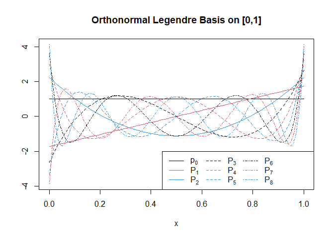

**Legendre Polynomial on \[-1,1\]**

-   Bonnet’s recursion formula

$$\begin{aligned}
    (n+1)L\_{n+1}(t) = (2n+1)tL_n(t)-nL\_{n-1}(t).
    \end{aligned}$$

$$\begin{aligned}
    &L_0(t) = 1\\
    &L_1(t) = t\\
    &L_2(t) = 2^{-1}(3t^2-1)\\
    &L_3(t) = 2^{-1}(5t^3-3t)\\
    &L_4(t) = 8^{-1}(35t^4-30t^2+3)\\
    &L_5(t) = 8^{-1}(63t^5-70t^3+15t)\\
    &L_6(t) = 16^{-1}(231t^6-315t^4+105t^2-5)\\
    &L_7(t) = 16^{-1}(429t^7-693t^5+315t^3-35t)\\
    &L_8(t) = 128^{-1}(6435t^8-12012t^6+6930t^4-1260t^2+35)\\
    &L_9(t) = 128^{-1}(12155t^9-25740t^7+18018t^5-4620t^3+315t)\\
    &L\_{10}(t) = 256^{-1}(46189t^{10}-109395t^8+90090t^6-30030t^4+3465t^2-63)
    \end{aligned}
$$

-   Othonormal basis

$$\begin{aligned}
    P\_{n}(t)=\left(\frac{2n+1}{2}\right)^{1/2}L_n(t)
    \end{aligned}$$

$$\begin{aligned}
    &P_0(t) = (1/2)^{1/2}2^{0}\\
    &P_1(t) = (3/2)^{1/2}2^{0}t\\
    &P_2(t) = (5/2)^{1/2}2^{-1}(3t^2-1)\\
    &P_3(t) = (7/2)^{1/2}2^{-1}(5t^3-3t)\\
    &P_4(t) = (9/2)^{1/2}2^{-3}(35t^4-30t^2+3)\\
    &P_5(t) = (11/2)^{1/2}2^{-3}(63t^5-70t^3+15t)\\
    &P_6(t) = (13/2)^{1/2}2^{-4}(231t^6-315t^4+105t^2-5)\\
    &P_7(t) = (15/2)^{1/2}2^{-4}(429t^7-693t^5+315t^3-35t)\\
    &P_8(t) = (17/2)^{1/2}2^{-7}(6435t^8-12012t^6+6930t^5-1260t^2+35)\\
    &P_9(t) = (19/2)^{1/2}2^{-7}(12155t^9-25740t^7+18018t^5-4620t^3+315t)\\
    &P\_{10}(t) = (21/2)^{1/2}2^{-8}(46189t^{10}-109395t^8+90090t^6-30030t^4+3465t^2-63)
    \end{aligned}
$$
  

**Legendre Polynomial on \[0,1\]**

$$\begin{aligned}
    P\_{n+1}(t)&=(2n+3)^{1/2}\left\[\frac{(2n+1)^{1/2}}{n+1}(2t-1)P_n(t)-\frac{n}{(n+1)(2n-1)^{1/2}}P\_{n-1}(t)\right\],\\
    \frac{P\_{n}(t)}{(2n+1)^{1/2}}&=\frac{2(n-1)+1}{n}(2t-1)\frac{P\_{n-1}(t)}{(2(n-1)+1)^{1/2}}-\frac{(n-2)+1}{n}\frac{P\_{n-2}(t)}{(2(n-2)+1)^{1/2}}
    \end{aligned}$$

$$\begin{aligned}
    &P_0(t)=1\\
    &P_1(t)=3^{1/2}(2t-1)\\
    &P_2(t)=5^{1/2}(6t^2-6t+1)\\
    &P_3(t)=7^{1/2}(20t^3-30t^2+12t-1)\\
    &P_4(t)=9^{1/2}(70t^4-140t^3+90t^2-20t+1)\\
    &P_5(t)=11^{1/2}(252t^5-630t^4+560t^3-210t^2+30t-1)\\
    &P_6(t)=13^{1/2}(924 t^6 - 2772 t^5 + 3150 t^4 - 1680 t^3 + 420 t^2 - 42 t + 1)\\
    &P_7(t)=15^{1/2}(3432 t^7 - 12012 t^6 + 16632 t^5 - 11550 t^4 + 4200 t^3 - 756 t^2 + 56 t - 1
    )\\
    &P_8(t)=17^{1/2}(12870 t^8 - 51480 t^7 + 84084 t^6 - 72072 t^5 + 34650 t^4 - 9240 t^3 + 1260 t^2 - 72 t + 1)\\
    &P_9(t)=19^{1/2}(48620 t^9 - 218790 t^8 + 411840 t^7 - 420420 t^6 + 252252 t^5 - 90090 t^4 + 18480 t^3 \\&\qquad\qquad - 1980 t^2 + 90 t - 1)\\
    &P\_{10}(t)=21^{1/2}(184756 t^{10} - 923780 t^9 + 1969110 t^8 - 2333760 t^7 + 1681680 t^6 - 756756 t^5 + 210210 t^4 \\&\qquad\qquad- 34320 t^3 + 2970 t^2 - 110 t + 1)
    \end{aligned}$$

